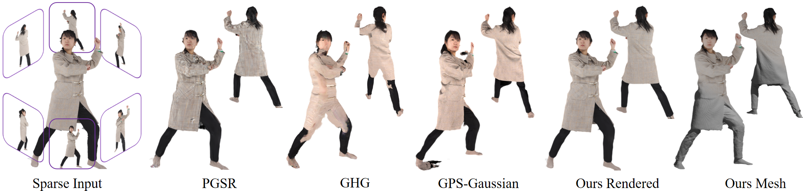
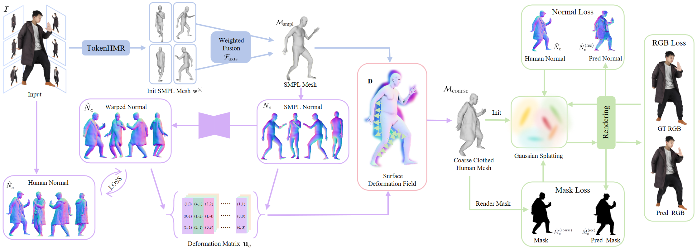
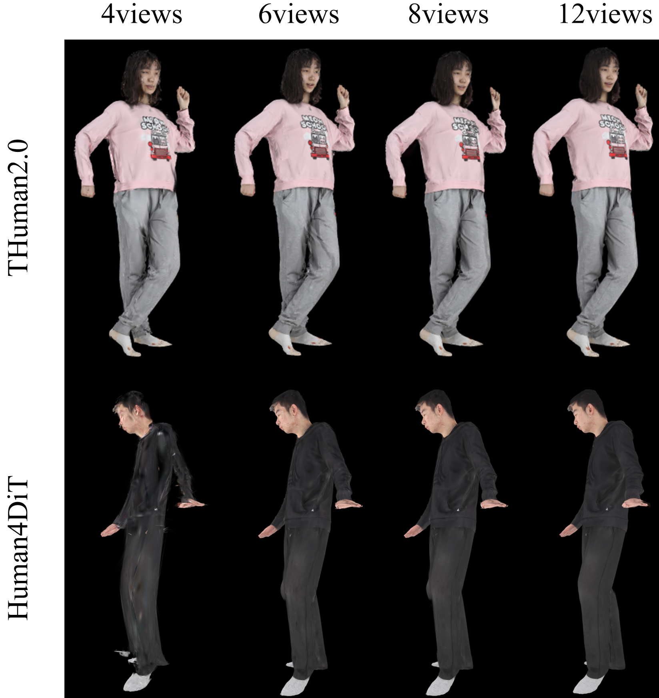
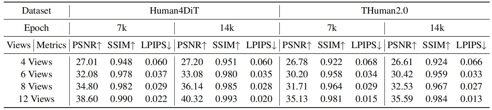
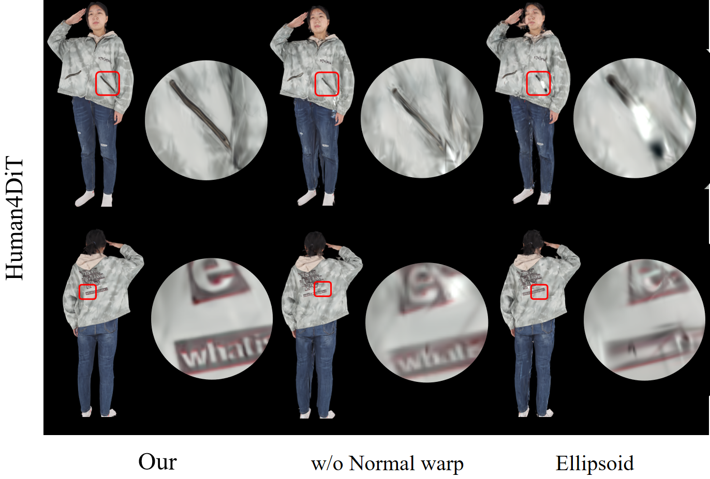
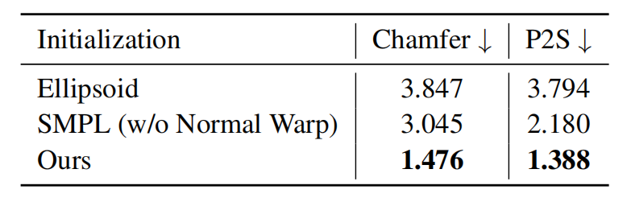
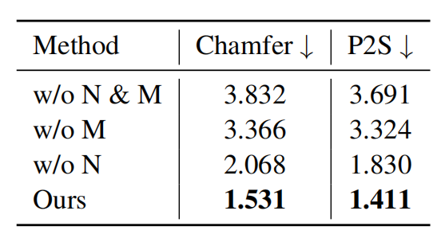
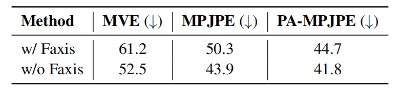

  <h1 align="center" style="font-size: 28px;">
    GEO-HUMAN: GEOMETRICALLY-GUIDED 3D GAUSSIAN SPLATTING  
    FOR HIGH-FIDELITY HUMAN RECONSTRUCTION UNDER SPARSE VIEWS
  </h1>

  

    <a href="https://github.com/The-GUAN"><strong>Jinfeng Guan</strong></a> ·
    <a href="https://scholar.google.com.hk/citations?user=j9d8QPgAAAAJ&hl=zh-CN"><strong>Yunqi Gao</strong></a> ·
    <a href="https://orcid.org/0009-0006-9198-1650"><strong>Zunian Wan</strong></a> ·
    <a href="https://github.com/zhaojiancheng007"><strong>Jiancheng Zhao</strong></a> ·
    <a href="https://www.ogawa-lab.org/people/?page_id=259"><strong>Takefumi Ogawa</strong></a>
  

  

    
  

 
Geo-Human combines mesh priors with 3DGS to reconstruct high-fidelity humans from sparse views, improving geometry and texture consistency.
 

## News :triangular_flag_on_post:

- [2025/9/28] Both key section code and supplementary experiments are available.

## Abstract

we propose Geo-Human, a human reconstruction framework that combines the geometric stability of traditional mesh-based methods with the high-fidelity rendering of 3DGS, substantially improving the reconstruction quality and consistency with sparse views. Given a few input views, the corresponding SMPL models are first estimated and fused via a weighted blending scheme to obtain an accurate overall representation. An encoder-decoder network then transforms the model’s normals into image-space normals to compute a deformation field. This deformation field warps the mesh, generating a coarse clothed human model consistent with the input image cues. The resulting mesh serves as a robust initialization for 3D Gaussian Splatting, and the optimization is further supervised by silhouette masks and normal maps inferred from the input images to enhance reconstruction fidelity and multi-view consistency. Experimental results demonstrate that Geo-Human significantly outperforms existing state-of-the-art methods in both geometric accuracy and rendering of novel views on the Human4DiT and THuman2.0 datasets.

## Overview

    

Given six images, we first estimate a pose-accurate SMPL mesh using <a href="https://github.com/saidwivedi/TokenHMR">TokenHMR</a>. A surface deformation flow is then computed via normal map alignment (Normal Warp) to generate a coarse clothed mesh. The reconstructed mesh and multi-view masks are used to initialize surface-aligned Gaussian primitives, enabling high-fidelity novel view synthesis and refined human reconstruction.

## visualization results

## Ablation Study

- ### Comparison of the Number of Input Views.

    

    

it is evident that our approach achieves accurate physical structure reconstruction and produces high-fidelity novel-view images from a limited number of input views.
Even when the number of input views is reduced to four, our method still outperforms most competing approaches.

- ### Comparison of Initialization and Normal Warp.

    

    

To validate the effectiveness of our initialization point cloud and Normal Warp, we replaced the initial point cloud with an ellipsoidal point cloud of the same size and an SMPL mesh without Normal Warp. Table demonstrates that an accurate human prior can enhance the quality of human reconstruction and also validates the effectiveness of the Normal Warp.

- ### Comparison of Loss Strategy.

    

To validate the effectiveness of the normal loss and mask loss, we compare four variants in the final mesh reconstruction: w/o both normal and mask loss, w/o normal loss, w/o mask loss, and our full method. As shown in Table, the results confirm the effectiveness of our loss strategy, demonstrating that the normal and mask loss further optimizes the 2D Gaussian points, enabling Geo-Human to achieve more physically accurate geometry modeling.

- ### Comparison of Weighted Fusion.

    

As shown in Table, the effectiveness of our Weighted Fusion strategy is validated by consistently outperforming the single-view TokenHMR baseline across all three metrics. It enables more accurate SMPL mesh estimation and demonstrates improved robustness in handling complex human poses.

